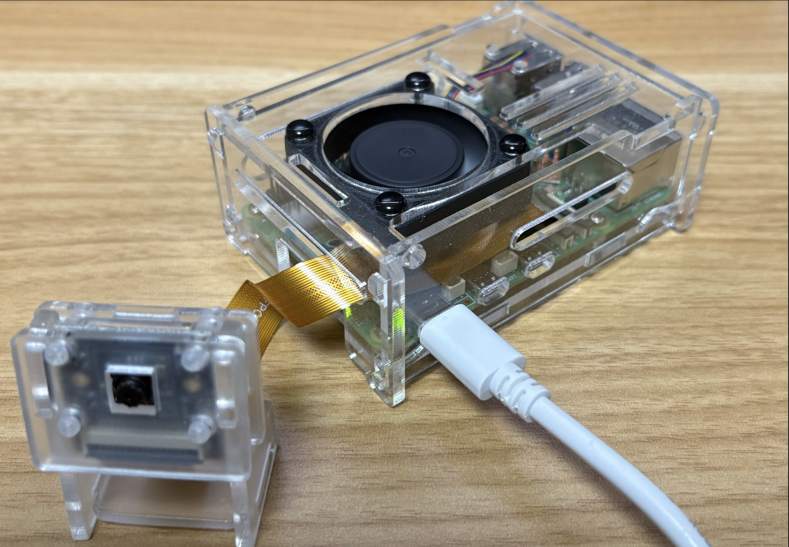
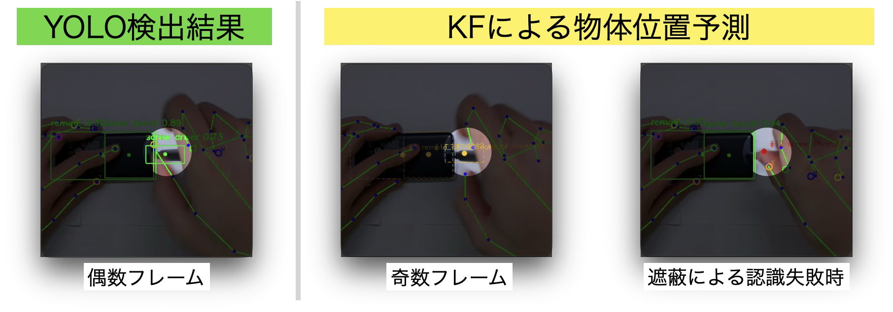

# 生産現場のDXに向けた人手作業判別システム

## 1. 背景と目的
製造現場の自動化が進む一方で、複雑な組立や検査・確認工程では、依然として人の手による作業が不可欠です。しかし、手作業には手順の誤りや作業漏れといったリスクが常に伴います。\
本プロジェクトでは、作業者の **「指先」** と **「部品」** の動きをリアルタイムに認識し、その位置関係から作業内容を判別するエッジAIシステムを開発しました。これにより、人手作業のミスを即座に検知し、生産現場の品質向上と工程管理のDX化を支援します。

  

## 2.　人手作業判別
生産ラインにおける代表的な人手作業である「外観検査」と「ネジ締め」を対象に人手作業分類を行います。
- **外観検査**\
部品に対して手指が接近し、手指の動きに伴って対象物が移動する特徴を持つ
- **ネジ締め**\
部品とドライバーに対して手指が接近し、短周期で回転動作を繰り返す特徴を持つ

これらの動作の違いを、「指先の軌跡」「回転速度」「部品との相対距離」として数値化し、識別モデルによって判定します。

※以下に動作デモ（2倍速）を表示します。プレビューが表示されない場合は、[こちら](https://github.com/user-attachments/assets/e9631f98-95d9-44af-80bb-d68bdd654acf)からご確認ください。

  <video src="https://github.com/user-attachments/assets/e9631f98-95d9-44af-80bb-d68bdd654acf" width="600" autoplay loop muted playsinline>
    あなたのブラウザはビデオタグをサポートしていません。
  </video>

## 3. システム構造
### 3.1 現場へ即時導入可能のエッジデバイス
工場内での迅速なセットアップを実現するため、小型なエッジデバイス **Raspberry Pi 5**を採用しました。\
コンパクトな筐体と低消費電力という特性を活かし、既存の製造ラインへの後付け設置に最適です。\
参考：[Raspberry Pi 5 詳細スペック](https://www.switch-science.com/products/10055?src=raspberrypi)

  

### 3.2 ３つのAIモデルの統合
限られた計算リソースで「指と物の相互作用」を正確に捉えるため、役割の異なる3つのアルゴリズムを統合しています。

  
| モデル | 役割 |実装手法・学習状況|
| --- | --- |--- |  
| MediaPipe Hands | 手指ランドマーク（21箇所）の検出 |学習済みモデルの利用| 
| YOLOv26n | 作業対象物および工具の検出 |独自データのアノテーション+ファインチューニング| 
| SVM | 特徴量に基づく作業種別の分類 |独自データによる新規学習|

## 4. リアルタイム認識の実現
### 4.1 検知モデルの交互実行による負荷分散
MediaPipeとYOLOは共に計算負荷が高く、CPUのみを利用するRaspberry Pi 5では、カメラフレームレート（10FPS）に対して推論が追従できない課題があるため、**検知モデル交互実行** を採用し負荷を分散しています。
- 奇数フレーム：MediaPipe Handsによる手指検出を実行
- 偶数フレーム：YOLO による物体検出を実行

### 4.2 カルマンフィルタ（KF）による軌跡補間
交互実行によって生じる「検出しないフレーム」の空白、および一時的な遮蔽で物体検出失敗の際に、カルマンフィルタを用いて位置を予測します。これにより、手指や物体のトラッキングが途切れることなく、SVMへ渡す特徴量の連続性を確保。低リソース環境下でもガタつきの少ない安定して判別精度を実現しています。

  

## 5.今後の展望（TODO）
本システムは「外観検査」と「ネジ締め」を対象とした試作段階にあるが、今後は実運用を見据え、多様な作業への対応、異常検知の実装、生産管理連携、技能継承へと発展させていく計画です。

- 認識対象の拡充: 配線、梱包、部品搬送など、より多様で細かな工程へ適用範囲拡大
- 異常検知の実装: 規定の手順から外れた際のリアルタイムアラート機能の追加
- 生産管理連携: 判定結果をクラウドへ集約し、サイクルタイムの自動集計や生産管理システム（MES）とのデータ連携を実現
- 技能継承支援: 熟練者と非熟練者の手指動作を比較・可視化し、教育訓練に活用できる仕組みの構築